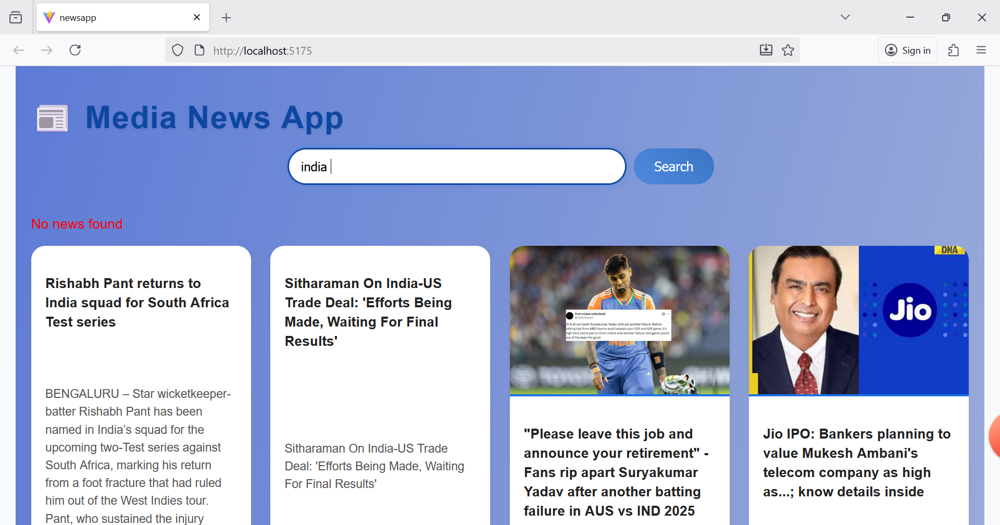

# 📰 Media News App

A **React-based Media News Application** that fetches and displays the latest news articles using the [MediaStack API](https://mediastack.com/).  
Users can search for specific topics (like "technology", "sports", "politics", etc.) and view news in a clean, responsive, and visually appealing layout.

---

## 🚀 Features
- 🔍 Search news by keyword  
- 📰 Fetches real-time articles from MediaStack API  
- 📱 Responsive layout for all devices  
- 💡 Modern UI with hover effects  
- ⚡ Fast and minimal design using React + Vite  

---

## 🖼️ App Screenshot

Here’s a real preview of the **Media News App** 👇  

> Example Search: **india**

---

## 🛠️ Tech Stack
- **Frontend:** React.js  
- **Styling:** CSS3  
- **API:** MediaStack  
- **Build Tool:** Vite  

---

## ⚙️ Installation & Setup

Clone the repository
git clone [https://github.com/aishwaryash775/media-news-app.git](https://github.com/aishwaryash775/media-App/new/main?readme=1)
cd media-news-app

# Install dependencies
npm install

➡️ Replace your API key in App.jsx:

javascript
Copy code
const API_KEY = 'YOUR_API_KEY_HERE';
Get your key from https://mediastack.com/.

🧠 How It Works
Fetches news via MediaStack API endpoint:

bash
Copy code
http://api.mediastack.com/v1/news?access_key=API_KEY&languages=en&sort=published_desc&keywords=SEARCH_TERM
Displays news title, image, description, source, and a “Read more” link.

Users can search for any keyword like “India”, “Technology”, “Health”, etc.

💅 UI Highlights
Gradient blue background with shadows

Rounded inputs and buttons

Hover animations on news cards

Responsive grid layout

📂 Project Structure
bash
Copy code
src/
├── App.jsx       # Main app logic
├── App.css       # Styles for UI
├── main.jsx      # React entry point
└── index.css     # Global base styles
👩‍💻 Author
Aishwarya Santosh Shinde
🎓 BE Computer Engineering
💻 Passionate about Frontend Development & UI Design

🪪 License
Licensed under the MIT License – free to use and modify.

🌟 Acknowledgments
MediaStack for the free News API

React for frontend framework inspiration
